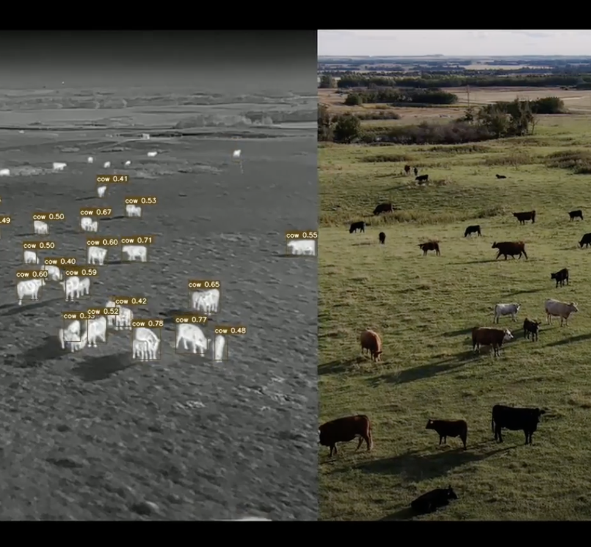
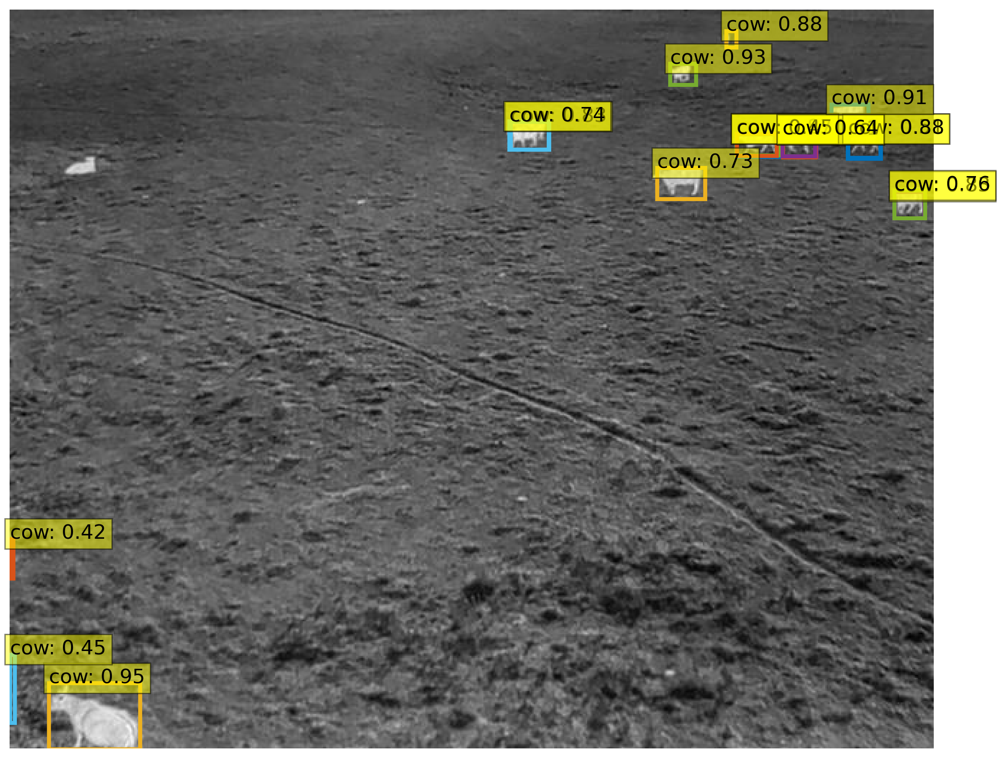
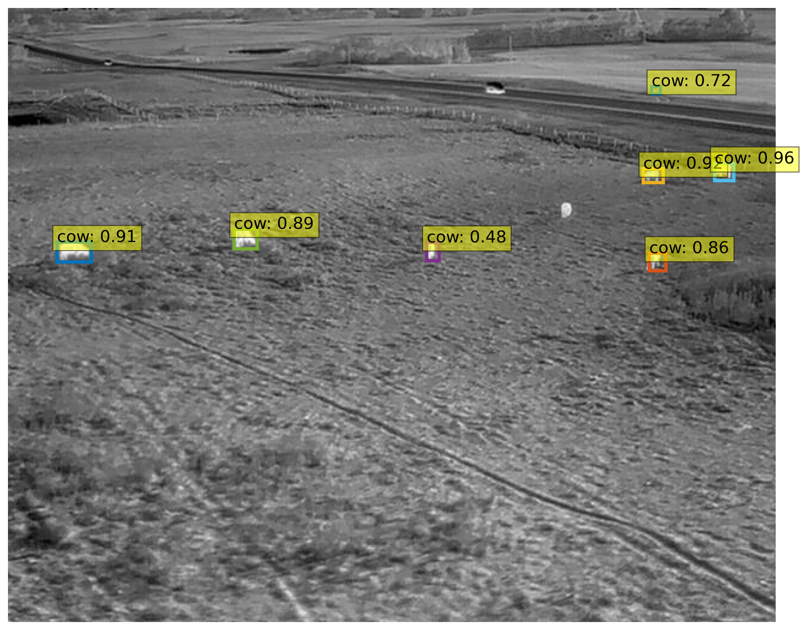

# DETR (DEtection TRansformer) Object Detection



## Table of Contents
- [Introduction](#introduction)
- [Features](#features)
- [Requirements](#requirements)
- [Installation](#installation)
- [Usage](#usage)
- [Results](#results)
- [Contributing](#contributing)

## Introduction

This project implements the DETR (DEtection TRansformer) model for object detection. DETR is a transformer-based model that directly predicts object bounding boxes without the need for anchor boxes and non-maximum suppression during training.

## Features

- **DETR Model**: Implementation of the DETR model architecture.
- **Training Pipeline**: Script for training the DETR model on your custom dataset.
- **Inference Script**: Demonstration of using the trained model for object detection.
- **Evaluation Tools**: Tools for evaluating the model's performance on a validation set.
- **Customization**: Easily adapt the code for your specific dataset and requirements.

## Requirements

- Python 3.x
- PyTorch
- torchvision
- tensorflow/keras

## Installation

1. Clone the repository:

    ```bash
    git clone https://github.com/NGoyal22/Cattle-Detection-using-DETR.git
    ```

2. Install dependencies:

    ```bash
    cd detr-object-detection
    pip install -r requirements.txt
    ```

3. Download pre-trained DETR weights:

    ```bash
    wget https://dl.fbaipublicfiles.com/detr/detr-r50-e632da11.pth -O detr-r50.pth
    ```

## Usage

1. (Provide any necessary setup steps, e.g., preparing your dataset)
2. Train the model:

    ```bash
    python train.py --dataset /path/to/dataset
    ```

3. Run inference:

    ```bash
    python inference.py --image /path/to/test/image.jpg --model detr-r50.pth
    ```

## Results





## Contributing

Contributions are welcome! Please follow the standard GitHub workflow:

1. Fork the repository.
2. Create a new branch for your feature: `git checkout -b feature-name`.
3. Make your changes and commit them: `git commit -m 'Add new feature'`.
4. Push to the branch: `git push origin feature-name`.
5. Submit a pull request.

Please make sure to update tests as appropriate.

